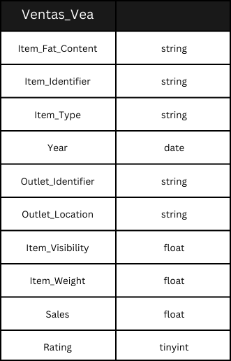
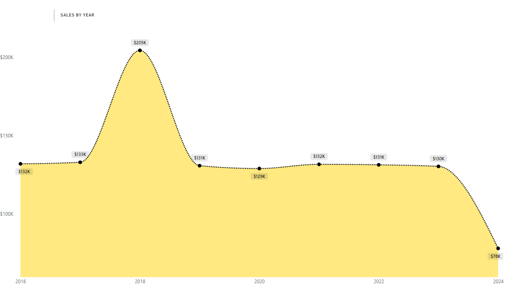
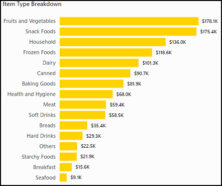
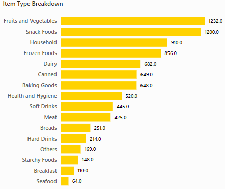

# Super Vea - Análisis de Ventas (2016-2024)

Analizaremos las ventas del Supermercado Vea entre 2016 y 2024. Un dashboard interactivo en Power BI puede ser descargado [aquí](Analisis_Ventas_Vea_Dashboard.pbix).

# Base del Proyecto

Vea es una línea de supermercados que opera hace más de 50 años en la República Argentina.

En este proyecto, analicé un dataset para investigar tendencias en las ganancias, valor promedio de compra (AOV), ventas por ubicación geográfica o tipo de producto, entre otros.

Este proyecto analiza y sintetiza la data para poder descubrir observaciones críticas que puedan mejorar el éxito comercial de Super Vea.

Las observaciones y recomendaciones son provistas sobre las siguientes áreas clave:

- **Análisis de las tendencias en las ventas:** Evaluación de los patrones de ventas a lo largo del tiempo, tanto a nivel íntegro como a nivel región, poniendo el foco en los ingresos, volumen de orden, y el valor promedio de la compra (AOV).
- **Rendimiento por línea de producto:** Un desglose del rendimiento en ventas de las variadas líneas de producto que ofrece Super Vea, mostrando su impacto en el volumen de compra y en los ingresos.
- **Comparación regional:** Una evaluación de ventas e ingresos por región.

Un dashboard interactivo en Power BI puede ser descargado [aquí](Analisis_Ventas_Vea_Dashboard.pbix).

# Estructura de los Datos & Chequeos Preliminares

La estructura de este dataset del Supermercado Vea consiste de una tabla llamada "Ventas_Vea", con un total de 8524 filas.

Con ayuda del "Asistente para Importación y Exportación de SQL Server", importamos el archivo [Ventas_Vea.csv](Ventas_Vea.csv) para poder utilizar los datos en SQL.

Las consultas en SQL realizadas para inspeccionar, limpiar, y organizar los datos para realizar el dashboard pueden ser encontradas [aquí](1_Data_Cleaning.sql).

Fue necesario un análisis exploratorio de los datos en SQL para responder varias preguntas empresariales. Estas consultas pueden ser encontradas [aquí](2_Analisis_Exploratorio_Datos.sql).

Una vez conseguida la limpieza pertinente de los datos, usando la herramienta mencionada al principio de esta sección, exportamos un nuevo archivo ".csv" bajo un nuevo nombre: [Analisis_Ventas_Vea.csv](Analisis_Ventas_Vea.csv). Dicho archivo será el utilizado para la confección del dashboard.

# KPIs & Dimensiones

### KPIs

- **Total de Ingresos:** Representa el valor total de las ventas y es un indicador primario de la salud financiera general y del rendimiento de la empresa.
- **Valor medio de los pedidos (AOV):**  Mide los ingresos medios generados por pedido, lo que puede proporcionar información sobre el comportamiento de compra de los clientes y la estrategia de precios de los productos.
- **Número de artículos vendidos:** Esta métrica ayuda a comprender el volumen global de ventas.
- **Valoración media del producto:** Refleja la satisfacción del cliente y la calidad del producto.

### Dimensiones

- **Año**
- **Tipo de Producto**
- **Ubicación de la Tienda**: Interior, Provincia de Buenos Aires, Capital Federal.

# Resumen Ejecutivo

### Repaso de los Hallazgos

### Tendencias en las Ventas

- Las ventas de la compañía han mantenido un **patrón muy estable** en los últimos 8 años, con la excepción de un pico observado en 2018 con un notable **aumento del 54%** respecto al 2017. Este fue el único año en el que se superó la barrera de los $200K.
En general, salvo la presencia de ese valor atípico, los ingresos están siempre en el rango de los **$129-133K**, con una mediana de **$131,5K**.
- A pesar de que falten los datos de los últimos 3 meses del año 2024, igualmente el rumbo es desilusionante con unos ingresos proyectados de **$104K**, lo que representaría un **descenso en ventas del 26%** respecto al año anterior.

### Ventas por Región

- Los ingresos se componen en un **61%** de la zona bonaerense o de la Ciudad Autónoma de Buenos Aires. Si bien es un factor a considerar la densidad poblacional en estos lugares, puede ser un llamado de atención para los equipos de marketing de Super Vea en el Interior donde tiene una presencia mucho menor.

### Desglose por Productos

 

- La relación entre el ranking de un producto en ambos desgloses es prácticamente lineal.
- Tanto en cantidad de unidades vendidas como en ingresos generados, frutas y vegetales es la categoría con mejor rendimiento. Se podría potenciar aún más los esfuerzos en ventas debido a su alta demanda.
- Un porcentaje alto de los ingresos es compuesto por productos bajos en grasa. Aunque esto puede resaltar una preferencia del consumidor por los productos saludables, es más probable que indique un deficiente trabajo de marketing y/o de precios en el resto de los productos que tienden a ser de consumo más habitual.

# Recomendaciones

- Investigar el descenso de las ventas de este año analizando las posibles causas, como los cambios en las preferencias de los clientes, las condiciones del mercado, la oferta de productos, los precios o la competencia, y ajustar las estrategias de marketing o las promociones en función de estos datos para recuperar el impulso.
- Centrar los esfuerzos de marketing en las regiones con mejores resultados como el AMBA, mediante campañas personalizadas, y la ampliación de la oferta de productos para garantizar que la disponibilidad de productos se ajuste a la demanda de los clientes.
- Reevaluar el inventario de categorías de bajo rendimiento como «Marisco» y «Desayuno» y centrándose en la venta cruzada o la agrupación con artículos de alta demanda como «Frutas y verduras» para impulsar las ventas.
- Aumentar la satisfacción y retención de los clientes recabando opiniones para identificar áreas de mejora, como la calidad del producto o el servicio, y realizando ajustes específicos para mejorar la valoración media de 3.9, lo que podría aumentar la fidelidad de los clientes y potencialmente las ventas.
- Aumentar el valor medio de los pedidos (AOV) de 140,99 $ aplicando estrategias de venta cruzada y venta adicional, como ofrecer descuentos en compras más grandes o crear packs de valor, animando a los clientes a gastar más por pedido y compensando el descenso en el número de ventas.
